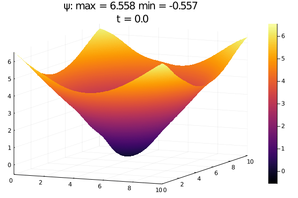

<h1 align="center">
  Physics-Informed Machine Learning Simulator for Wildfire Propagation
</h1>

The aim of this work is to evaluate the feasibility of re-implementing some key parts of the widely used Weather Research and Forecasting [WRF-SFIRE](https://github.com/openwfm/WRF-SFIRE) simulator by replacing its core differential equations numerical solvers with state-of-the-art physics-informed machine learning techniques to solve ODEs and PDEs in order to increase its computational efficiency. The goal is to evaluate the feasibility of a real-time simulator for wildfire spread prediction based on PINNs. Our ML approach is based on Physics Informed Neural Networks implemented in the [NeuralPDE.jl](https://github.com/SciML/NeuralPDE.jl) package, which turns an integration problem into a minimization one.  

NeuralPDE Architecture                           |  Standard Integration
:-----------------------------------------------:|:-------------------------:
  |  

### [Model Selection](/Model_Selection)
A collection of our attempts to find a proper model which suites all of our needs. We have explored different architectures within the field of Scientific Machine Learning.  We started our investigations using the [DiffEqFlux.jl](https://github.com/SciML/DiffEqFlux.jl) library, which defines and solves neural ordinary differential equations (i.e. ODEs where a neural network defines its derivative function). We finally chose [NeuralPDE.jl](https://github.com/SciML/NeuralPDE.jl) because does not require numerical solvers and is interfaced with the very high levels model representation library [ModelingToolkit.jl](https://github.com/SciML/ModelingToolkit.jl)

### [Interpolation](/BC_Interpolation)
Some utility notebooks needed to implement key informations (terrain slope, wind field) in our model. It also provides better perfomances in terms of speed and computational load.

  

### [WRF](/WRF)
The results obtained by our simulation performed with the Weather Research Forecast system. First of all we performed a profiling with the perf tool, in order to mesure the overhead of WRF's subroutines

  

Later we ran several simulations of fire and atmospherical events. We then kept the result for the Isom Creek and OneFire cases, which were used to compare with the output of the neural network.

### [Level Set Implementation](/Level_Set_Implementation)
The level-set is the mathematical core for calculating the spread of the fire.  The minimization of the loss functions is the process that actually solves the PDE and constitutesthe  main  load  for  the  CPU.  It  can  be  easily  accelerated  using GPUs. The  model  was  implemented  using  the  low-level  interface of the [NeuralPDE.jl](https://github.com/SciML/NeuralPDE.jl) library which contains the necessary methods for the generation of the training datasets and of theloss functions starting from the explicit form of the equations and the boundary conditions.

Level set equation solution computed by PINNs                         |  Level set equation solution computed by WRF
:-----------------------------------------------:|:-------------------------:
  |  

  

### [Euler System Implementation](/Euler_System_Implementation)
This is our attempt to implement the atmospherical model of WRF using PINNS ([NeuralPDE.jl](https://github.com/SciML/NeuralPDE.jl)). It is necessary because the level set equation (wildfire propagation) is strongly dependent on wind and other atmospheric parameters. Writing and solving the 7-equation Euler system in Julia was really challenging, in fact at the moment we are not aware of any publications where these NeuralPDE.jl and the PINNs are applied to systems of PDE of such complexity.  Unfortunately, the NeuralPDE.jl library is still unable to treat this kind of problem with stability and often incurs errors due to internal divergence calculations. Despite  this,  we  have  been  able  to  obtain  convergence  of  the loss function, although it is not enough to present valid results. We contacted the authors of these libraries, that are still under development, and we are looking forward to continue the development.

### [Link to Google Drive](https://drive.google.com/drive/folders/1wUCKUyVwC0Pf-e9WlLiqOxRLF0or2D0U)
In the Google Drive linked above are hosted the results of the simulations performed with WRF. The results are in the standard NetCDF format and can be explored easily using the [Ncview tool](http://meteora.ucsd.edu/~pierce/ncview_home_page.html).

