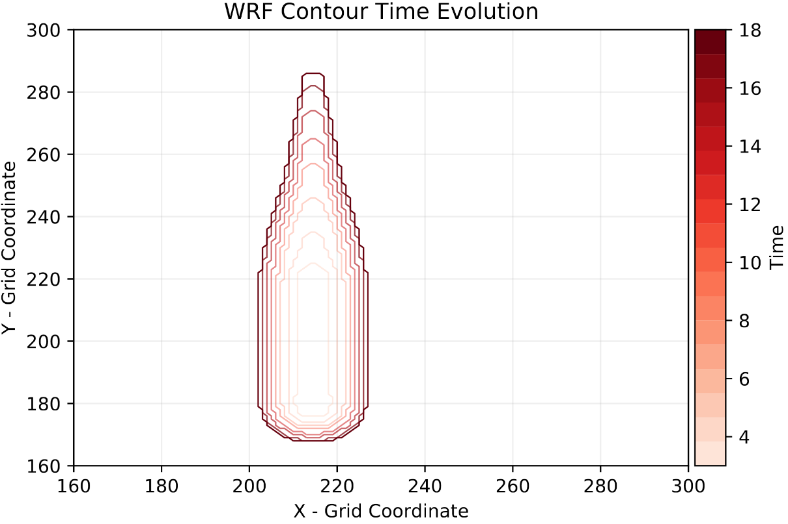

# Work in progress...

  
 

<h1 align="center">
  Physics-Informed Machine Learning Simulator for Wildfire Propagation
</h1>

The aim of this work is to evaluate the feasibility of re-implementing some key parts of the widely used Weather Research and Forecasting [WRF-SFIRE](https://github.com/openwfm/WRF-SFIRE) simulator by replacing its core differential equations numerical solvers with state-of-the-art physics-informed machine learning techniques to solve ODEs and PDEs, in order to transform it into a real-time simulator for wildfire spread prediction. Our ML approach is based on Physics Informed Neural Networks implemented in the [NeuralPDE.jl](https://github.com/SciML/NeuralPDE.jl) package, which turns an integration problem into a minimization one.  

NeuralPDE Architecture                           |  Standard Integration
:-----------------------------------------------:|:-------------------------:
  |  

### [Model Selection](/Model_Selection)
A collection of our attempts to find a proper model which suites all of our needs. We have ex-plored different architectures within the field of Scientific Ma-chine Learning.  We started our investigations using the DiffE-qFlux.jllibrary, which defines and solves neural ordinarydifferential equations (i.e. ODEs where a neural network defines its derivative function)

### [Interpolation](/BC_Interpolation)
Some utility notebooks needed to implement key informations (terrain slope, wind field) in our model. It also provides better perfomances in terms of speed and computational load.

  

### [WRF](/WRF)
The results obtained by our simulation performed with the Weather Research Forecast system. Firstly we have done a profiling with the perf tool, in order to mesure the overhead of WRF's subroutines. Later we run several simulations of fire and atmospherical events. We then kept the result for the Isom Creek and OneFire cases.

### [Level Set Implementation](/Level_Set_Implementation)
The level-set is the mathematical core for calculating the spread of the fire.  The minimization of the loss func-tions is the process that actually solves the PDE and constitutesthe  main  load  for  the  CPU.  It  can  be  easily  accelerated  usingGPUs. The  model  was  implemented  using  the  low-level  interface of   the NeuralPDE.jl library which contains the necessarymethods for the generation of the training datasets and of theloss functions starting from the explicit form of the equations and the boundary conditions.

Level set equation solution computed by PINNs                           |  Level set equation solution computed by WRF
:-----------------------------------------------:|:-------------------------:
  |  

### [Euler System Implementation](/Euler_System_Implementation)
This is our attempt to implement the atmospherical model of WRF into neuralPDE, because it necessry if a couple model (which has an improved precision) is needed. Writing and solving the 7-equation Euler system in Julia wasreally challenging,  in fact at the moment we are not aware ofany publications where these techniques are yet applied to PDEsystems of such complexity.  Unfortunately, theNeuralPDElibrary is still unable to treat this kind of problem with stability,and often incurs errors due to internal divergence calculations.Despite  this,  we  have  been  able  to  obtain  convergence  of  theloss function, although it is not enough to present valid results.We contacted the authors of these libraries, that are still underdevelopment, and we are looking forward to contributing.

### [Julia Environments](/Julia_Environments)
This are the Julia enviroments needed to correctly use our code.

### [Link to Google Drive]()

